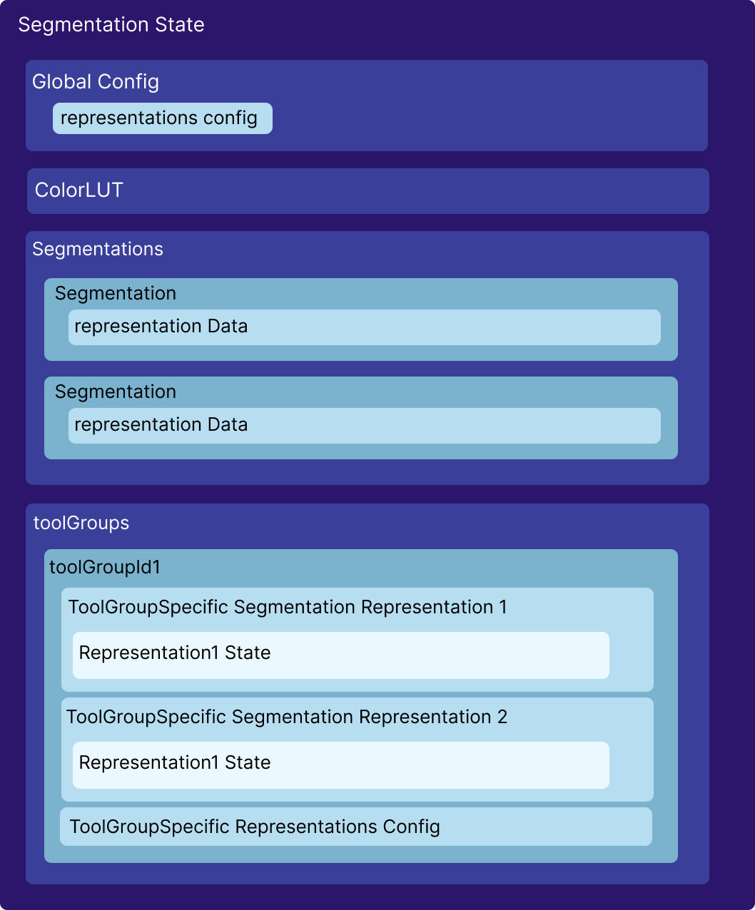

# State

`SegmentationState` stores all the information regarding the current state of the `Segmentation`s
and `SegmentationRepresentation`s in the library. As mentioned in the previous section
we have decoupled the `Segmentation`s and `SegmentationRepresentation`s from each other.
From a `Segmentation` various representations can be created (labelmap supported currently).
Therefore, the state also stores segmentations and their toolGroup-specific representations separately.

An overview of the state is shown below.

<div style={{textAlign: 'center', width:"80%"}}>



</div>

## Global Config

`Cornerstone3DTools` implements two configurations, and the consumer
can set each of them individually. `GlobalConfig` in the state
stores the global configuration for all segmentation representations in all toolGroups.

You can read more in the [`config`](./config.md) on how to set each individually.

## ColorLUT

`SegmentationState` Stores an array of `colorLUT`s that are used to render the segmentation representations.
`Cornerstone3DTools` initially adds 255 colors (`[ [0,0,0,0], [221, 84, 84, 255],[77, 228, 121, 255], ... ]`) as the
first index of this array, and by default all segmentation representations use the first colorLUT.
However, using the color API in the [config](./config.md#color-api) you can add more colors to the global colorLUT
in the state and/or change the colorLUT for a specific segmentation representation.

## Segmentations

`SegmentationState` stores all the segmentations in an array. It should be noted that
`Segmentation` and `SegmentationRepresentation` are two separate concepts.
Each Segmentation Object inside the state, stores all the required information
in order for the `SegmentationRepresentation` to be created.

Each segmentation object has the following properties:

```js
{
  segmentationId: 'segmentation1',
  mainType: 'Labelmap',
  activeSegmentIndex: 0,
  segmentsLocked: new Set(),
  label: 'segmentation1',
  cachedStats: {},
  representationData: {
    LABELMAP: {
      volumeId: 'segmentation1',
    },
    CONTOUR: {
      geometryIds: ['contourSet1', 'contourSet2'],
    },
  },
},
```

- `segmentationId`: a required field provided by the consumer. This is the unique identifier for the segmentation.
- `mainType`: set internally, by default 'Labelmap'
- `activeSegmentIndex`: the active segment index that will be used
  to modify the data of the segmentation by tools.
- `segmentsLocked`: a set of locked segment indices which will not be modified by tools.
- `label`: the label of the segmentation.
- `cachedStats`: a cache of the stats of the segmentation (volume etc. - not used currently)
- `representationData`: **THE MOST IMPORTANT PART**, this is where
  the data for creation of the `SegmentationRepresentation` is stored.
  For instance, in `LABELMAP` representation, the required information for creating the `SegmentationRepresentation` is a cached `volumeId`.

### Adding Segmentations to the State

Since, `Segmentation` and `SegmentationRepresentation` are separated from each other, first,
we need to add the `segmentation` to the state. This can be done by
top level API:

```js
import { segmentation, Enums } from '@alireza-beta-script/tools';

segmentation.addSegmentations([
  {
    segmentationId,
    representation: {
      type: Enums.SegmentationRepresentations.Labelmap,
      data: {
        volumeId: segmentationId,
      },
    },
  },
]);
```

As seen, we add an array of segmentations to the state each
including a segmentationId, and a `representation` which includes
the type and the data that is required to create the `SegmentationRepresentation`.

:::note Important
Adding a `Segmentation` to the state WILL NOT render the segmentation. You should
add the `SegmentationRepresentation`s to the toolGroup that is intended to render
the segmentation representation (e.g., Labelmap, etc.). We will see how below.
:::

## ToolGroups

`SegmentationDisplayTool` is a Tool inside `Cornerstone3DTools` that is responsible for
displaying the segmentation representations. From each `Segmentation`, a `ToolGroup` can
create a `SegmentationRepresentation` and display it.

### Adding a SegmentationRepresentation to a ToolGroup

Next, we need to add the `SegmentationRepresentation` to the `ToolGroup`. This can be done by
using the `addSegmentationRepresentation` method of the `Segmentation` module. This way,
all the viewports that are added to the `ToolGroup` will be updated their renderers
to include the new `SegmentationRepresentation`.

```js
import {
  segmentation,
  SegmentationDisplayTool,
  Enums,
} from '@alireza-beta-script/tools';

/**
 * Setup toolGroups and addViewports to them before hand
 */

const toolGroup = ToolGroupManager.getToolGroup(toolGroupId);

toolGroup.addTool(SegmentationDisplayTool.toolName);
toolGroup.setToolEnabled(SegmentationDisplayTool.toolName);

await segmentation.addSegmentationRepresentations(toolGroupId, [
  {
    segmentationId,
    type: Enums.SegmentationRepresentations.Labelmap,
  },
]);
```

or if the ToolGroup is displaying the segmentation representation with a specific config, you can provide it in the last argument.

```js
const toolGroupSpecificRepresentationConfig = {
  renderInactiveSegmentations: true,
  representations: {
    [Enums.SegmentationRepresentations.Labelmap]: {
      renderOutline: true,
    },
  },
};

await segmentation.addSegmentationRepresentations(
  toolGroupId,
  [
    {
      segmentationId,
      type: Enums.SegmentationRepresentations.Labelmap,
    },
  ],
  toolGroupSpecificRepresentationConfig
);
```
